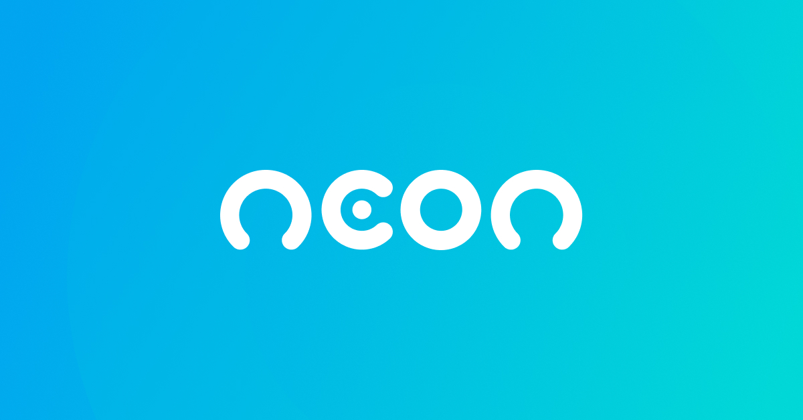

<h1 align="center">
  
 </h1>
 

 Redesign of Neon Bank website, developed during the Codeboost course :rocket:

<h5 align="center"> Status: finished :heavy_check_mark:</h5>
<h5 align="center"><a target="_blank" href="https://projeto-neon.netlify.app/">Link to app</a></h5>

<h2>Table of content</h2>

  <a href="#objectives">Objectives</a> • 
  <a href="#tech">Technologies</a> • 
  <a href="#contribution">Contribution</a> • 
  <a href="#license">License</a> • 
  <a href="#author">Author</a>

<h2 id="objectives">Objectives</h2>

Improve skills with animations, libs embbeding, as well as HTML, CSS and SASS.

<h2>Technologies</h2>
<ul>
  <li>HTML</li>
    <li>CSS</li>
    <li>SASS</li>
    <li>Keyframes</li>
  <li><a href="https://michalsnik.github.io/aos/">Lib AOS</a></li>
</ul>

<h2>Contributions</h2>

Special thanks to <a href="https://codeboost.com.br/">Codeboost</a> and their colaborators.

<h2>License</h2>

<h2>Author</h2>
<h3>Made with :heart: by Cindy Hanae</h3>
<a href="mailto:cindy.hanae1@gmail.com" target="_blank">

